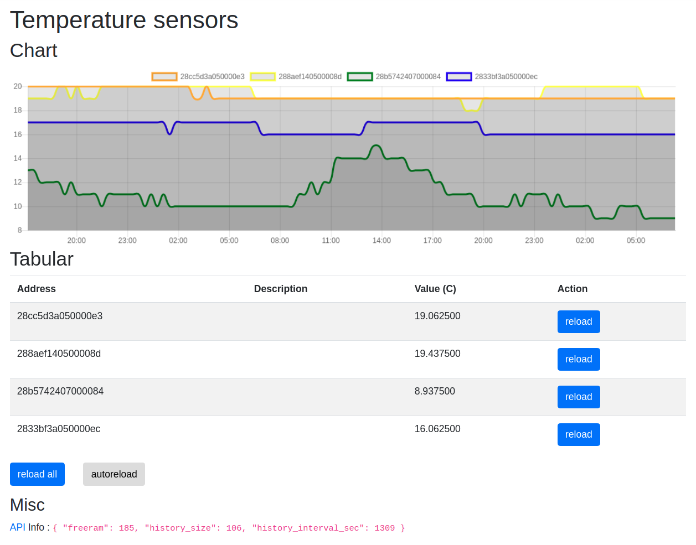

# iot-temp-sensors

atmega328 + onewire ds18b20 + ethernet enc28j60




- [features](#features)
- [prerequisites](#prerequisites)
- [config](#config)
- [debugging](#debugging)
- [api](#api)
- [sketch size](#sketch-size)
- [security considerations](#security-considerations)

## features

- easy customization through direct index.htm and app.js editing and debugging locally
- automatic compilatio of index.htm.h and app.js.h to be included as flash string
- [alloc automatically](https://github.com/devel0/iot-temp-sensors/blob/747eedead33772415a47ea5b0cbd67a9d4185bc4/temp-sensors/temp-sensors.ino#L152-L167) a backlog of temperature recording based upon available ram

## prerequisites

- [iot-atmega328p-enc28j60](https://github.com/devel0/iot-atmega328p-enc28j60/blob/master/README.md)

## config

- ( see prerequisites prj )
- disable [ENABLE_CORS](https://github.com/devel0/iot-temp-sensors/blob/432999ee57a9892da64955140d62139edcb04fc9/temp-sensors/temp-sensors.ino#L12) in production
- set temperature device id to add a description (optional) in [app.js](https://github.com/devel0/iot-temp-sensors/blob/432999ee57a9892da64955140d62139edcb04fc9/temp-sensors/app.js#L1-L12)

## debugging

- start `code .` from sketch folder
- program the chip `ctrl+shift+p` through usbasp programmer
- drag `index.htm` and `app.js` into code
- config `app.js`
  - tune [baseurl](https://github.com/devel0/iot-temp-sensors/blob/432999ee57a9892da64955140d62139edcb04fc9/temp-sensors/app.js#L20)
- double click `index.htm` from file manager to open in a browser
- now webpage talk to atmega webapi through enc28j60 ( can use F12 and set some breakpoints from browser, may need useful to click on browser pretty button to format code because its minified )
- note : modified app.js and index.htm will compiled into flash automatically through [prebuild](https://github.com/devel0/iot-temp-sensors/blob/432999ee57a9892da64955140d62139edcb04fc9/temp-sensors/.vscode/arduino.json#L6) utility [gen-h](https://github.com/devel0/iot-temp-sensors/blob/432999ee57a9892da64955140d62139edcb04fc9/temp-sensors/gen-h)

## api

| address | content type | result example |
|---|---|---|
| `/tempdevices` | json | `{"tempdevices":["28886f5a050000dd","2865e05a0500001a","28af8123070000e2"]}` |
| `/temp/id` | text | `19.562500` |
| `/info` | json | `{"freeram":187, "history_size":123, "history_interval_sec":10}` |
| `/temphistory` | json | `[{"28886f5a050000dd":[20,20,20,20,20,20,20,20,20,20,21,24,25,27,28]},{"2865e05a0500001a":[20,20,20,20,20,20,20,20,20,20,20,20,20,20,20]},{"28af8123070000e2":[21,21,21,21,21,21,21,21,21,21,21,21,21,21,21]}]` |
| `/app.js` | js | content of app.js |
| `/` | html | content of index.htm |

## sketch size

*serial debug included*

**ENC28J60 (udp disabled)**

- `UIP_CONF_UDP=0` in `UIPEthernet/utility/uipethernet-conf.h`

```
Sketch uses 28070 bytes (85%) of program storage space. Maximum is 32768 bytes.
Global variables use 1216 bytes (59%) of dynamic memory, leaving 832 bytes for local variables. Maximum is 2048 bytes.
```

**W5500**

```
Sketch uses 27076 bytes (82%) of program storage space. Maximum is 32768 bytes.
Global variables use 702 bytes (34%) of dynamic memory, leaving 1346 bytes for local variables. Maximum is 2048 bytes.
```

## security considerations

- see [prerequisite considerations](https://github.com/devel0/iot-atmega328p-enc28j60/tree/4a4fc753572a2c6fd427d38278091163c69b46cd#security-considerations)
- [ENABLE_CORS](https://github.com/devel0/iot-temp-sensors/blob/8baeae070887b1b4300d076d6dee94ce3c4f6a09/temp-sensors/temp-sensors.ino#L12) even disabled not imply any check at server(atmega)-side so effectively a non-browser request can execute request from any crossing domain; can mitigate wrapping with [nginx](https://enable-cors.org/server_nginx.html)
