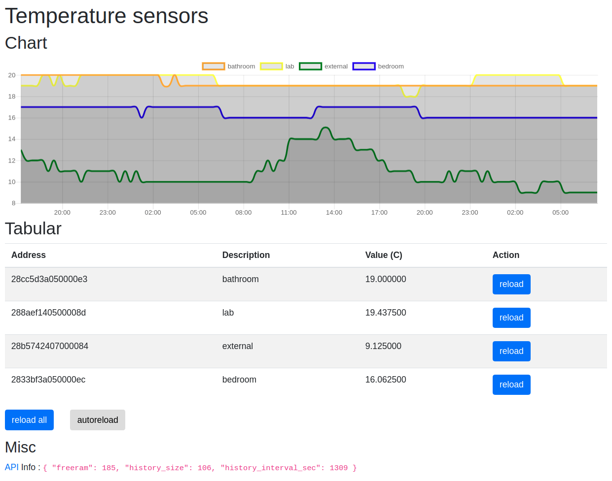

# iot-temp-sensors

atmega328 + onewire ds18b20 + ethernet enc28j60

| **update** : version with W5500/sd card [here](https://github.com/devel0/iot-temp-sensors-sd-card) ; schematics [here](https://easyeda.com/editor#id=|7506cd41b26244d4b4f3a225eba49999) just skip sd card and power enc28j60 from 3v3



## prerequisites

- software
  - install [vscode arduino](https://github.com/devel0/knowledge/blob/master/electronics/vscode-arduino.md)
  - install [UIPEthernet](https://github.com/UIPEthernet/UIPEthernet)
  - install [MemoryUsage](https://github.com/Locoduino/MemoryUsage)
- see [iot-atmega328p-enc28j60](https://github.com/devel0/iot-atmega328p-enc28j60/blob/master/README.md)

## temp sensor description

- after first connection to http://aaa.bbb.ccc.ddd of webserver copy and paste temp sensor addresses to `tempDescription` array givin a description

## debug

```
cd iot-temp-sensors/temp-sensors
code .
```

- choose `usbasp` programmer
- `ctrl+shift+p upload using programmer`

## sketch size

- serial debug included

```
```

- serial debug included, `UIP_CONF_UDP=1` in `UIPEthernet/utility/uipethernet-conf.h`

```
Sketch uses 29258 bytes (89%) of program storage space. Maximum is 32768 bytes.
Global variables use 1524 bytes (74%) of dynamic memory, leaving 524 bytes for local variables. Maximum is 2048 bytes.
```

- serial debug included, `UIP_CONF_UDP=0` in `UIPEthernet/utility/uipethernet-conf.h`

```
Sketch uses 25116 bytes (76%) of program storage space. Maximum is 32768 bytes.
Global variables use 1265 bytes (61%) of dynamic memory, leaving 783 bytes for local variables. Maximum is 2048 bytes.
```

## notes

- current size (serial debug included)

```
Sketch uses 28082 bytes (85%) of program storage space. Maximum is 32768 bytes.
Global variables use 1360 bytes (66%) of dynamic memory, leaving 688 bytes for local variables. Maximum is 2048 bytes.
```

- to change serial debug speed edit `arduino-utils/DebugMacros.h`
- can work in [dhcp](https://github.com/devel0/iot-temp-sensors/blob/c0d3a918df7af414b01e09c07f2cd6cc2e3d634d/temp-sensors/temp-sensors.ino#L62) ( uses some more flash )
- [temperature update interval](https://github.com/devel0/iot-temp-sensors/blob/c0d3a918df7af414b01e09c07f2cd6cc2e3d634d/temp-sensors/temp-sensors.ino#L23) at [server side](https://github.com/devel0/iot-temp-sensors/blob/c0d3a918df7af414b01e09c07f2cd6cc2e3d634d/temp-sensors/temp-sensors.ino#L354-L357) set to 5 sec
- [onewire bus](https://github.com/devel0/iot-temp-sensors/blob/c0d3a918df7af414b01e09c07f2cd6cc2e3d634d/temp-sensors/temp-sensors.ino#L25) set to digital pin 3 ( [pin mapping](https://www.arduino.cc/en/Hacking/PinMapping168) )
- [resolution](https://github.com/devel0/iot-temp-sensors/blob/c0d3a918df7af414b01e09c07f2cd6cc2e3d634d/temp-sensors/temp-sensors.ino#L110) to 12 bits
- http protocol
  - [read only first header](https://github.com/devel0/iot-temp-sensors/blob/c0d3a918df7af414b01e09c07f2cd6cc2e3d634d/temp-sensors/temp-sensors.ino#L158-L176) due to constrained memory device
  - [mobile friendly](https://github.com/devel0/iot-temp-sensors/blob/c0d3a918df7af414b01e09c07f2cd6cc2e3d634d/temp-sensors/temp-sensors.ino#L239)
  - [bootstrap](https://github.com/devel0/iot-temp-sensors/blob/c0d3a918df7af414b01e09c07f2cd6cc2e3d634d/temp-sensors/temp-sensors.ino#L240) and [script](https://github.com/devel0/iot-temp-sensors/blob/c0d3a918df7af414b01e09c07f2cd6cc2e3d634d/temp-sensors/temp-sensors.ino#L342)
  - [jquery](https://github.com/devel0/iot-temp-sensors/blob/c0d3a918df7af414b01e09c07f2cd6cc2e3d634d/temp-sensors/temp-sensors.ino#L341)
  - [named and replaced page content](https://github.com/devel0/iot-temp-sensors/blob/c0d3a918df7af414b01e09c07f2cd6cc2e3d634d/temp-sensors/temp-sensors.ino#L267-L269)
  
